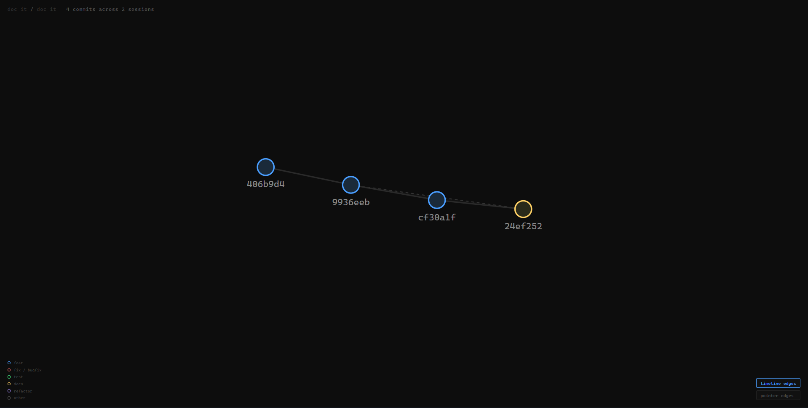

# doc-it

Auto-generate human-readable developer session logs from your git history — with an interactive commit graph.

Run `doc-it run` inside any git repo. It reads your commits, summarizes what changed and why using an LLM, detects related past commits, and writes a structured `DEVLOG.md` — one section per session, growing vertically over time. Run `doc-it serve` to explore your commit history as an interactive force-directed graph.

---

## Demo

```
$ doc-it run
Repo: /home/user/my-project
Mode: UPDATE (last run: 2026-04-04, since: 4ec361e)
Running update graph...
  [node] load_commits — found 2 commit(s)
  [router] 2 commit(s) found — continuing
  [node] summarize — processing 2 commit(s)
  [node] detect_pointers — [a1b2c3d] -> related: ['4ec361e']
  [node] write — state saved. Last commit: a1b2c3d

+ Processed 2 commit(s)
+ DEVLOG written: /home/user/my-project/DEVLOG.md
```

The generated `DEVLOG.md` looks like this:

```markdown
## Session — 2026-04-04

**Commits in this session:** 2

### [a1b2c3d] feat: add user authentication
*yourname — 2026-04-04*

> This commit introduces JWT-based authentication to the API. A new `auth.py`
> module handles token generation and validation, and the `/login` endpoint
> was added to `routes.py`. Passwords are hashed using bcrypt before storage.

**Related:** [4ec361e — feat: add user model](#4ec361e-feat-add-user-model)
```

---

## Commit Graph

```
$ doc-it serve
+ Graph written: /home/user/my-project/graph.html
+ Serving at http://localhost:4242/graph.html
  Press Ctrl+C to stop.
```

<!-- graph-screenshot -->

<!-- /graph-screenshot -->

Each node is a commit. Solid edges show the chronological timeline. Dashed edges show semantic relationships detected by the LLM — commits that touched the same module or worked on the same feature. Click any node to open a sidebar with the commit summary, files changed, and related commits.

---

## Install

Requires Python 3.11+ and a Google API key (free tier works).

```bash
git clone https://github.com/Sethumadhavan004/doc-it
cd doc-it
pip install -e .
```

Create a `.env` file inside the `doc-it/` directory:

```bash
# doc-it/.env
GOOGLE_API_KEY=your_key_here
```

Get a free key at [aistudio.google.com](https://aistudio.google.com).

---

## Usage

```bash
# From inside any git repo:
doc-it run          # generate or update DEVLOG.md
doc-it serve        # open interactive commit graph in browser
doc-it graph        # write graph.html without serving
```

**`doc-it run`**
- First run: scans full commit history, creates `DEVLOG.md` and `devlog.json`. Pauses 15s between LLM calls to respect Gemma's free tier rate limit (15K TPM) — expect ~15s per commit.
- Subsequent runs: reads new commits since last run, appends a new session entry.

**`doc-it serve`**
- Regenerates `graph.html` from `devlog.json`, starts a local HTTP server, and opens the graph in your browser automatically.
- Use `--port` to change the default port (4242).

`DEVLOG.md` and `devlog.json` are written to your repo root and should be committed — they are the artifacts doc-it produces for visitors and agents. `graph.html` is generated on demand and is excluded from git. `.doc-it-state.json` is local-only and automatically added to `.gitignore`.

doc-it excludes `DEVLOG.md` from the diffs it feeds to the LLM, so it never summarizes its own previous output.

---

## How it works

```
git history
    │
    ▼
git_reader.py       — subprocess calls to git log / git show / git diff-tree
    │
    ▼
LangGraph StateGraph (graph.py)
    │
    ├── load_commits      — fetch commits since last run
    ├── [conditional]     — bail early if no new commits
    ├── load_prev_entries — read existing DEVLOG for context
    ├── summarize         — LangChain chain: diff → plain English summary
    ├── detect_pointers   — LangChain chain: find related past commits
    ├── render            — assemble markdown session entry
    └── write             — append to DEVLOG.md, write devlog.json, save state
    │
    ▼
devlog.json         — machine-readable manifest (sessions, tags, files, pointers)
    │
    ▼
graph_renderer.py   — reads devlog.json, backfills missing history, renders graph.html
    │
    ▼
graph.html          — self-contained D3 force-directed graph (D3 inlined, no CDN)
```

**LangChain** handles the LLM pipeline — prompt templates, the `|` composition operator (LCEL), and output parsing.

**LangGraph** orchestrates the pipeline as a stateful graph — each node reads and writes a shared `TypedDict` state, with a conditional edge that skips processing when there's nothing new.

**D3 force simulation** drives the commit graph — nodes repel each other, edges act as springs, and a center force keeps the layout stable. The graph is fully interactive: drag nodes, toggle edge types, click to inspect commits.

---

## Tech stack

| Component | Library |
|---|---|
| CLI | [Click](https://click.palletsprojects.com/) |
| LLM pipeline | [LangChain](https://python.langchain.com/) |
| Pipeline orchestration | [LangGraph](https://langchain-ai.github.io/langgraph/) |
| LLM | Gemma 3 via [Google Generative AI](https://ai.google.dev/) |
| Commit graph | [D3.js v7](https://d3js.org/) |
| Config | [python-dotenv](https://github.com/theskumar/python-dotenv) |

---

## Requirements

- Python 3.11+
- A `GOOGLE_API_KEY` from [Google AI Studio](https://aistudio.google.com) (free tier: 30 RPM)
- Git installed and available on PATH

---

## Project structure

```
doc-it/
  doc_it/
    cli.py              — Click entrypoint, run / graph / serve commands
    git_reader.py       — git log / git show / git diff-tree via subprocess
    chains.py           — LangChain chains: summarizer + pointer detection
    graph.py            — LangGraph StateGraph for the update pipeline
    renderer.py         — Markdown + JSON assembly, DEVLOG writer
    graph_renderer.py   — Reads devlog.json, backfills history, renders graph.html
    state.py            — .doc-it-state.json read/write
    templates/
      graph.html        — D3 force graph template
      d3.min.js         — D3 v7 bundled locally (no CDN dependency)
  pyproject.toml        — pip-installable package definition
  README.md
```
